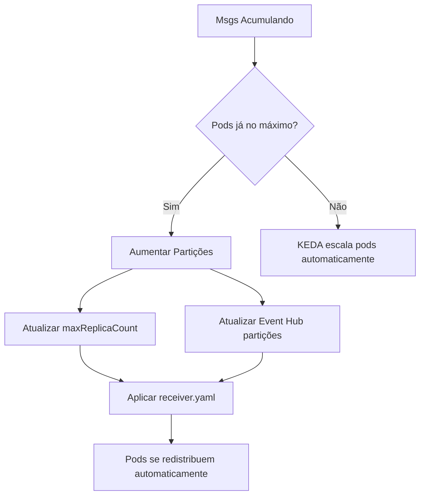

# KEDA + Kafka/Event Hub: Estratégias de Escalonamento

## 📋 Visão Geral

Este documento explica como o KEDA funciona com Kafka/Event Hub e as diferenças importantes em relação ao Service Bus, especialmente no que se refere ao relacionamento entre **partições** e **pods**.

## 🎯 Conceito Fundamental: Partições = Limite de Pods

### ⚠️ Regra de Ouro do Kafka
```
Máximo de Pods Úteis = Número de Partições
```

**Por quê?**
- Cada partição pode ser consumida por **apenas 1 consumer** no mesmo Consumer Group
- Pods extras ficam **IDLE** (ociosos) sem partições para consumir
- Não há ganho de performance com mais pods que partições

## 🔄 Como Funciona o Escalonamento

### Cenário Atual: 2 Partições
```yaml
# receiver.yaml (configuração atual)
maxReplicaCount: 20  # ⚠️ PROBLEMÁTICO!
```

**Resultado prático:**
```
Tópico "orders" (2 partições apenas)
├── Partition 0 ──── Pod-1 ✅ (ativo)
├── Partition 1 ──── Pod-2 ✅ (ativo)
├── Pod-3 ❌ (IDLE - sem trabalho)
├── Pod-4 ❌ (IDLE - sem trabalho)
├── ...
└── Pod-20 ❌ (IDLE - sem trabalho)
```

## 📊 KEDA vs Service Bus vs Kafka

| Aspecto | Service Bus | Kafka/Event Hub |
|---------|-------------|-----------------|
| **Escalonamento** | Baseado em msgs na fila | Baseado em msgs não processadas **POR PARTIÇÃO** |
| **Limite de Consumers** | Ilimitado (competição) | 1 consumer por partição no mesmo grupo |
| **Pods Máximos Úteis** | Sem limite teórico | = Número de partições |
| **Distribuição** | Round-robin entre consumers | 1 partição por consumer |

## 🎛️ Configurações Recomendadas

### Para 2 Partições (atual):
```yaml
apiVersion: keda.sh/v1alpha1
kind: ScaledObject
metadata:
  name: receiver
spec:
  scaleTargetRef:
    name: receiver
  pollingInterval: 15
  minReplicaCount: 0
  maxReplicaCount: 2  # ✅ Igual ao número de partições
  cooldownPeriod: 30
  triggers:
  - type: azure-eventhub
    metadata:
      eventHubName: orders
      consumerGroup: orders-consumer
      unprocessedEventThreshold: "10"
      eventHubNamespace: aks-keda-eh-lab-9zbdqD
```

### Para 5 Partições (escalado):
```yaml
maxReplicaCount: 5  # ✅ Igual ao número de partições
```

## 🚀 Estratégia de Escalonamento

### 1️⃣ Monitoramento
```bash
# Verificar partições atuais
az eventhubs eventhub show \
  --resource-group aks-keda-eh-kafka-lab \
  --namespace-name aks-keda-eh-kafka-lab-9zbdqD \
  --name orders \
  --query partitionCount

# Monitorar lag por partição
kubectl describe scaledobject receiver -n order
```

### 2️⃣ Quando Escalar Partições?

**Sinais de que precisa mais partições:**
- ✅ Lag consistentemente alto (>threshold)
- ✅ 2 pods já estão no máximo de CPU/Memory
- ✅ Mensagens acumulando mesmo com 2 pods ativos
- ✅ Throughput não consegue acompanhar a demanda

**Como identificar:**
```bash
# Ver utilização dos pods
kubectl top pods -n order -l app=receiver

# Ver métricas do KEDA
kubectl get hpa -n order
kubectl describe hpa keda-hpa-receiver -n order
```

### 3️⃣ Processo de Escalonamento



## ⚡ Exemplo Prático: Escalonamento de 2 para 5 Partições

### Passo 1: Aumentar partições no Event Hub
```bash
az eventhubs eventhub update \
  --resource-group aks-keda-eh-kafka-lab \
  --namespace-name aks-keda-eh-kafka-lab-9zbdqD \
  --name orders \
  --partition-count 5
```

### Passo 2: Atualizar KEDA
```yaml
# receiver.yaml
maxReplicaCount: 5  # Era 20, agora 5
```

### Passo 3: Aplicar mudanças
```bash
kubectl apply -f receiver.yaml
```

### Resultado:
```
Tópico "orders" (5 partições)
├── Partition 0 ──── Pod-1 ✅
├── Partition 1 ──── Pod-2 ✅  
├── Partition 2 ──── Pod-3 ✅
├── Partition 3 ──── Pod-4 ✅
└── Partition 4 ──── Pod-5 ✅
```

## 📈 Métricas de Monitoramento

### KPIs Importantes:
1. **Lag por Partição**: Mensagens não processadas
2. **Throughput por Pod**: Msgs/segundo processadas
3. **CPU/Memory por Pod**: Utilização de recursos
4. **Tempo de Rebalanceamento**: Quando pods entram/saem

### Comandos Úteis:
```bash
# Ver lag atual
kubectl get scaledobject receiver -n order -o yaml

# Ver pods ativos
kubectl get pods -n order -l app=receiver

# Ver logs de rebalanceamento
kubectl logs -n order -l app=receiver --tail=50 | grep -i "rebalance\|partition"
```

## 🎯 Boas Práticas

### ✅ Faça:
- Monitore lag por partição regularmente
- Alinhe `maxReplicaCount` com número de partições
- Teste escalonamento em ambiente de desenvolvimento
- Considere custos ao aumentar partições (são permanentes)

### ❌ Evite:
- `maxReplicaCount` maior que partições
- Mudar partições sem atualizar KEDA
- Escalonamento reativo (muito tarde)
- Reduzir partições (não é suportado)

## 💰 Considerações de Custo

- **Partições são permanentes** - não podem ser reduzidas
- **Cada partição tem custo** no Azure Event Hub
- **Planeje capacidade** antes de escalar
- **Monitore utilização** para otimizar custos

## 🔧 Troubleshooting

### Problema: Pods IDLE
```bash
# Verificar distribuição de partições
kubectl exec -it <receiver-pod> -n order -- ps aux
```

### Problema: Lag alto mesmo com pods disponíveis
```bash
# Verificar se Consumer Group está correto
kubectl logs <receiver-pod> -n order | grep "group.id"
```

### Problema: Rebalanceamento constante
```bash
# Verificar estabilidade dos pods
kubectl get pods -n order -w
```

## 📚 Recursos Adicionais

- [KEDA Azure Event Hub Scaler](https://keda.sh/docs/latest/scalers/azure-event-hub/)
- [Kafka Consumer Groups](https://kafka.apache.org/documentation/#intro_consumers)
- [Azure Event Hub Partitioning](https://docs.microsoft.com/en-us/azure/event-hubs/event-hubs-scalability#partitions)

---

**📝 Resumo:** Em Kafka/Event Hub, o número de partições é o fator limitante para escalonamento horizontal. Sempre alinhe `maxReplicaCount` com o número de partições para otimizar recursos e performance.
